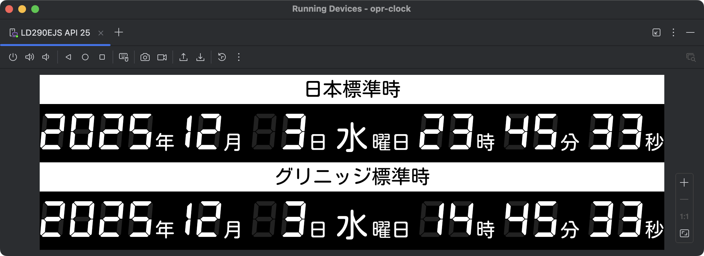

# opr-clock-android

A digital clock for LD290EJS, inspired by the clock in the JMA's operation room

## Overview

opr-clock is a dual-timezone digital clock designed for ultra-wide displays.
It presents Japan Standard Time (JST) and Greenwich Mean Time (GMT/UTC) in a vertically stacked layout optimized for a 1920×540 resolution.

This project runs as an Android application on the LG in TOUCH Stretch Display “LD290EJS”, a unique 29-inch panel featuring an unusually wide 1920×540 aspect ratio.

The interface uses the DSEG7Classic and Kosugi Maru fonts to reproduce the segmented-digit aesthetic inspired by the Japan Meteorological Agency’s operation room.

## Fonts

This project includes the following fonts:

*   **KosugiMaru**: Licensed under the Apache License, Version 2.0.
    A copy of the license is available in the [LICENSES/KosugiMaru-LICENSE.txt](LICENSES/KosugiMaru-LICENSE.txt) file.

*   **DSEG7Classic**: Licensed under the SIL Open Font License, Version 1.1.
    A copy of the license is available in the [LICENSES/DSEG-LICENSE.txt](LICENSES/DSEG-LICENSE.txt) file.